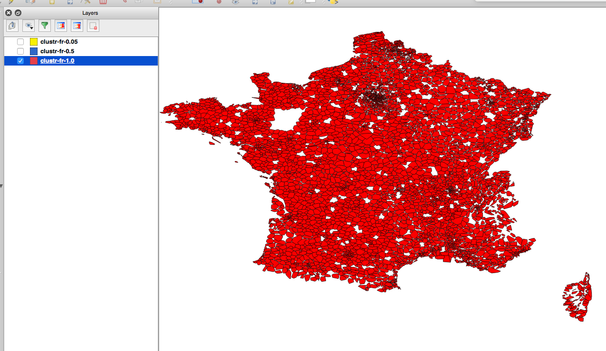
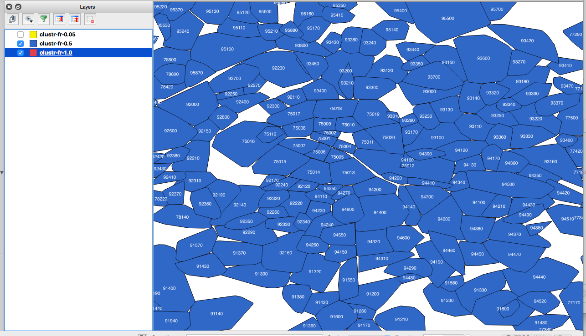

# whosonfirst-data-postalcode-fr

Postal codes for France.

## About the data

This dataset is incomplete and approximate.

Specifically of the [27,119 records](data) included in this repository 21, 513 of them lack any geographic data. They are ["visiting Null Island"](https://whosonfirst.mapzen.com/spelunker/nullisland/?iso=fr) so to speak. The postal codes were originally imported from the [GeoPlanet 7.10.0 data dump](https://archive.org/details/geoplanet_data_7.10.0.zip) and it's still not immediately clear to whether France really has this many postal codes or what.

The [remaining 5, 606 records](https://whosonfirst.mapzen.com/spelunker/placetypes/postalcode/?iso=fr&exclude=nullisland) have geometries that were derived from the available address data for Australia [as provided by OpenAddresses](https://results.openaddresses.io/) on July 23, 2016 which was used to generate polygons using the [Clustr](https://github.com/whosonfirst/Clustr) tool.

All geometries generated using the Clustr tool should be considered approximate as denoted by the `mz:is_approximate` and `mz:is_clustr` properties. In time we expect (hope) that these records will be updated with current and authoritative data provided by the French postal service.

Until then these geometries are [at least more accurate]() than "all of France" and have been assigned [full hierarchies](https://whosonfirst.mapzen.com/spelunker/id//descendants/?exclude=nullisland&placetype=postalcode) in Who's On First land.

## See also

* https://github.com/whosonfirst-data/whosonfirst-data-postalcode
* https://openaddresses.io/
* https://github.com/whosonfirst/Clustr