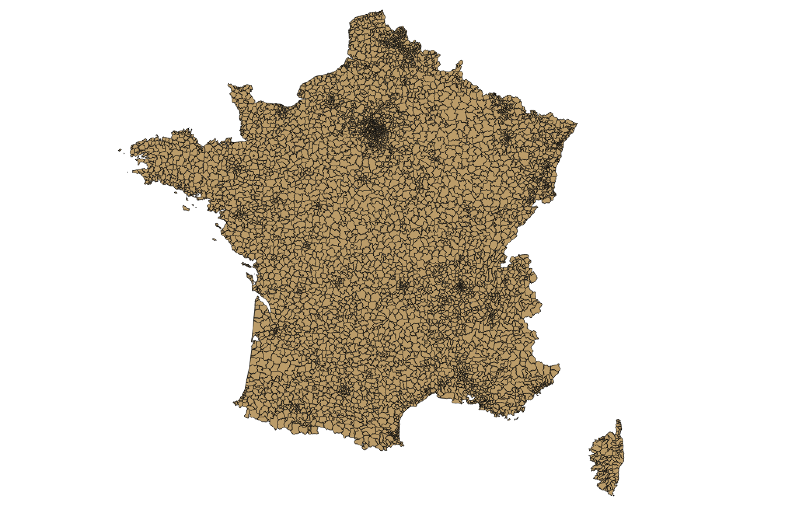

# whosonfirst-data-postalcode-fr

Postal codes for France.

## About the data

This dataset is incomplete and approximate.

Specifically of the [27,119 records](data) included in this repository 21, 513 of them lack any geographic data. They are ["visiting Null Island"](https://whosonfirst.mapzen.com/spelunker/nullisland/?iso=fr) so to speak.

_The postal codes were originally imported from the [GeoPlanet 7.10.0 data dump](https://archive.org/details/geoplanet_data_7.10.0.zip) and it's still not immediately clear whether France really has this many postal codes or what._

The [remaining 6,048 records](https://whosonfirst.mapzen.com/spelunker/placetypes/postalcode/?iso=fr&exclude=nullisland) have geometries that were derived from the available address data for France [as provided by Open Data France](https://github.com/whosonfirst/whosonfirst-sources/blob/master/sources/frgov.json) on Nov. 11, 2016.

Until then all geometries are [at least more accurate](https://whosonfirst.mapzen.com/spelunker/id/421307175/) than "all of France" and have been assigned [full hierarchies](https://whosonfirst.mapzen.com/spelunker/id/404228157/descendants/?exclude=nullisland&placetype=postalcode) in Who's On First land.

## See also

* https://github.com/whosonfirst-data/whosonfirst-data-postalcode